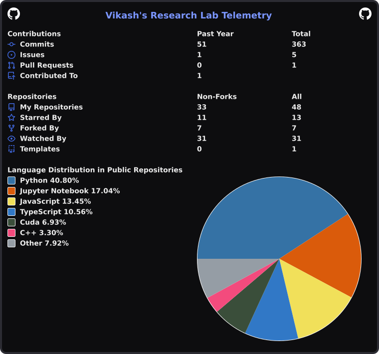

<p align="center">
  
</p>

<p align="center">
  <a href="https://vikash-singh.me"></a>
  <a href="https://vikash-singh.me/cv"></a>
  <a href="https://scholar.google.com/citations?user=zt0c4WsAAAAJ"></a>
  <a href="https://www.linkedin.com/in/vikash-singh-john/"></a>
  <a href="mailto:vikashjohn2505@gmail.com"></a>
</p>

## `> whoami`

I'm a Computer Science PhD student at **Case Western Reserve University**. I
make LLM reasoning **formally verifiable** by pairing language models with SMT
solvers and theorem provers, so their outputs can be mathematically checked
before anyone has to trust them.

```text
research/
├── formal-reasoning/       LLMs × SMT solvers × theorem provers
├── reliable-evaluation/    uncertainty, calibration, and trust
├── interpretable-ai/       explanations, bias, and model behavior
└── efficient-models/       pruning, LoRA, and optimization
```

## `> selected-work`

| | Project |
| :--- | :--- |
| **OPEN SOURCE** | **[OpenLeaf](https://github.com/vicky157/openleaf)** — a private, local-first LaTeX editor with live PDF preview, SyncTeX, document graphs, and offline storage |
| **NEURIPS 2025** | **[Grammars of Formal Uncertainty](https://arxiv.org/abs/2505.20047)** — when to trust LLMs in automated reasoning tasks |
| **HIPC 2025** | **[K⁴](https://arxiv.org/abs/2507.20051)** — online log anomaly detection through unsupervised typicality learning |

<p align="right"><a href="https://vikash-singh.me/publications">view all publications →</a></p>

## `> stack --list`

<p align="center">
  
  
  
  
  
  
  
  
  
</p>

## `> github --stats`

<p align="center">
  <a href="https://github.com/cicirello/user-statistician">
    
  </a>
</p>

---

<p align="center">
  <code>formal reasoning</code> · <code>reliable AI</code> · <code>open source</code>
  <br /><br />
  When I'm not testing the limits of language models, I'm usually looking up at
  the limits of the observable universe. 🌌
</p>
